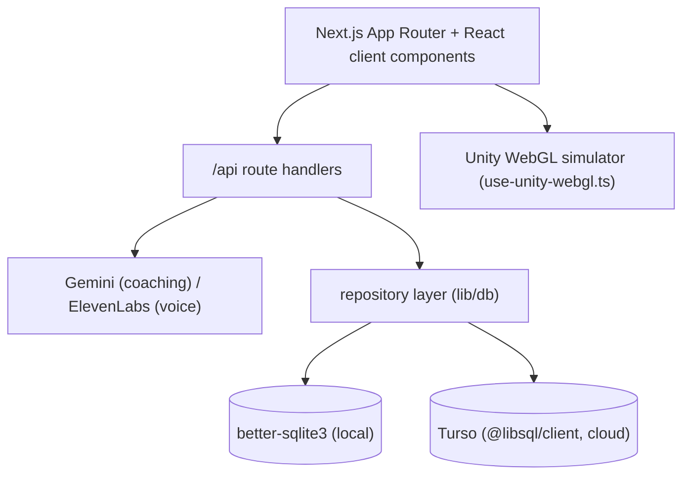

# ContinuLearn

An interactive platform for learning continuum robotics: a gamified track of
levels, a Unity WebGL simulator embedded in the page, and an AI coach for hints
and explanations. Learners adjust parameters like curvature, bend direction, and
segment length, then pass challenge checks to unlock the next level.

Live: https://continu-learn.vercel.app

## Learning flow

1. Sign in and open the map at `/learn`.
2. Pick a track (`practical`, `theory`, `pickplace`) and unlock levels in order.
3. Practical levels open the simulator at `/app?level=<id>`; parameter checks
   decide completion.
4. Theory levels show lessons and problems with an optional AI review chat.
5. Pick-and-place levels open dedicated scenes at `/pick-place?level=<id>`.
6. Progress and settings persist per user through the API routes.

## Architecture



- **Frontend**: Next.js App Router, Tailwind v4, Radix-based components. Unity
  builds served from `public/unity*`.
- **Simulation**: `components/simulator/simulator-shell.tsx` and
  `app/pick-place/page.tsx`; level content in `lib/levels.ts`,
  `lib/theory-levels.ts`, `lib/pick-place-levels.ts`; kinematics in
  `lib/kinematics.ts`.
- **AI**: Gemini for text, ElevenLabs for narration and transcription when
  configured.
- **Auth**: `NEXT_PUBLIC_AUTH_PROVIDER` selects `local` (session cookie) or
  `auth0` (redirect OAuth).
- **Data**: repository abstraction with a SQLite implementation for local dev and
  Turso for serverless. Schema in `db/schema.sql` (`users`, `user_settings`,
  `learning_progress`, `simulator_snapshots`, `theory_chat_threads`,
  `theory_chat_messages`, `auth_sessions`).

## Local development

Needs Node 20+.

```bash
npm install
cp .env.example .env.local     # fill values, see below
npm run dev                     # http://localhost:3000
```

```env
NEXT_PUBLIC_AUTH_PROVIDER=auth0
AUTH0_DOMAIN=
AUTH0_CLIENT_ID=
AUTH0_CLIENT_SECRET=
AUTH0_BASE_URL=http://localhost:3000
TURSO_DATABASE_URL=
TURSO_AUTH_TOKEN=
GEMINI_API_KEY=
OPENAI_API_KEY=
ELEVENLABS_API_KEY=
ELEVENLABS_VOICE_ID=
NEXT_PUBLIC_APP_URL=http://localhost:3000
```

If Turso variables are set, Turso is used; otherwise local SQLite. On Vercel
without Turso configured, initialisation fails on purpose.

## Scripts

```
npm run dev | build | start | lint
```

## API surface

```
Auth      /api/auth/{login,signup,callback,logout,session}
User      /api/user/{progress,settings}
Coaching  /api/coach            /api/coach/level-hint
          /api/coach/theory-help /api/coach/theory-chat
AI        /api/ai/usage  /api/ai/voice-query  /api/narrate
Infra     /api/db/health
```

## Deployment

Built for Vercel with Turso persistence. See `docs/auth0-setup.md`,
`docs/persistence-notes.md`, and `docs/unity-webgl-integration.md`.
