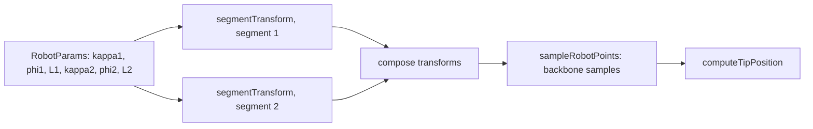
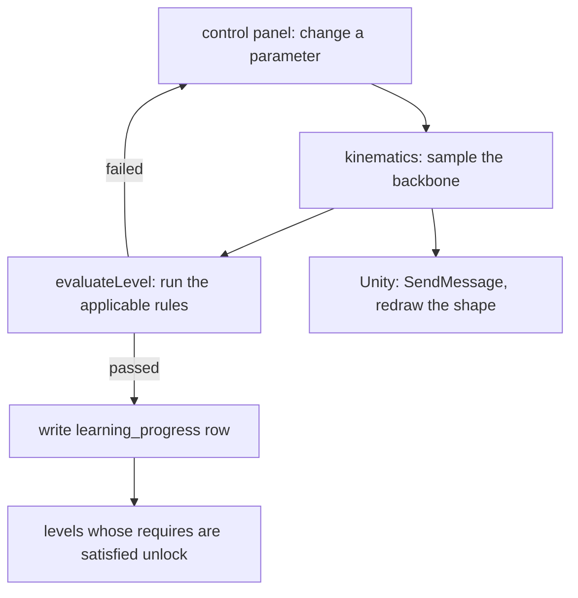

# ContinuLearn

A teaching app for continuum robotics. Learners adjust the parameters of a
two-segment constant-curvature robot, watch the shape update in an embedded
Unity WebGL simulator, and pass deterministic challenge checks to unlock the
next level. An AI coach explains configurations and answers questions by voice
or text.

Live: https://continu-learn.vercel.app

Next.js 16 (App Router, React 19), Tailwind v4, Radix UI. Three tracks:

| Track | Levels | Flow |
|-------|--------|------|
| `practical` | 10 | open the simulator at `/app?level=<id>`, meet the rules |
| `theory` | 8 | lessons and problems with an AI review chat |
| `pickplace` | 2 | dedicated Unity scenes at `/pick-place?level=<id>` |

## The kinematics are the point

`lib/kinematics.ts` implements the constant-curvature model directly. Each
segment has `(kappa, phi, L)`: curvature, bend-plane angle, and arc length.
`segmentTransform` builds the 4x4 homogeneous transform for a circular arc (and
degenerates to a pure translation when `|kappa| < 1e-6`). `sampleRobotPoints`
composes the two segment transforms and samples points along the backbone;
`computeTipPosition` returns the end point.



## A level attempt

Correctness is checked in TypeScript, not in Unity, so a level can be graded
even if the WebGL build fails to load. `lib/levels.ts` defines each level with
`initialParams`, a `requires` list of prerequisite level ids, and up to three
rule types:

| Rule | Check |
|------|-------|
| `paramRanges` | each `{ key, min?, max? }` on a `RobotParams` field |
| `tipTarget` | `computeTipPosition` within `threshold` of a target point |
| `avoidObstacles` | 28 samples per segment, fail if any point enters an obstacle sphere |



## Unity WebGL bridge

`hooks/use-unity-webgl.ts` injects the loader `<script>`, calls
`window.createUnityInstance(canvas, config, onProgress)`, tracks status
(`idle` to `loading-script` to `creating-instance` to `ready` / `error`), and
exposes `sendMessage(objectName, methodName, value)` to push parameters into the
running build. It tears the instance down (`instance.Quit()`, script removed) on
unmount. Three separate builds live under `public/unity`, `public/unity2`,
`public/unity3`.

## AI layer

`lib/ai/gemini.ts` wraps the Gemini REST API (`gemini-2.0-flash` by default,
`GEMINI_MODEL` overrides) and returns `null` when `GEMINI_API_KEY` is unset.
`parseGeminiJson` strips code fences and repairs bad escapes;
`normalizeLatexContent` fixes common LaTeX mangling before KaTeX rendering.

| Route | Purpose |
|-------|---------|
| `POST /api/coach` | takes the 6 params, returns a structured `CoachResponse` JSON (title, what changed, how it moves, a KaTeX `math_deep_dive`, one tip, safety note, voice script); serves a baked-in demo response with no key |
| `POST /api/coach/level-hint`, `/theory-help`, `/theory-chat` | hints and the theory review chat (chat accepts file and image attachments) |
| `POST /api/narrate` | text to ElevenLabs speech, returns `audio/mpeg`; 503 without a key |
| `POST /api/ai/voice-query` | multipart audio plus context, ElevenLabs transcription then a Gemini answer scoped to the current level |
| `POST /api/ai/usage` | one gateway that dispatches to the routes above by a `usage` string |

## Persistence

`lib/db` is one repository interface with two implementations, chosen by
`getRepository()`:

- `SqliteRepository` (`better-sqlite3`, file `db/app.sqlite`, applies
  `db/schema.sql`) for local development;
- `TursoRepository` (`@libsql/client`) when `TURSO_DATABASE_URL` and
  `TURSO_AUTH_TOKEN` are set.

On Vercel without Turso configured, `getRepository()` throws on purpose rather
than lose data silently. The instance is cached on `globalThis` and schema
initialisation is memoised.

Tables (`db/schema.sql`): `users`, `auth_sessions`, `user_settings` (save policy:
manual, interval, on level complete, or on exit), `learning_progress`
(`UNIQUE(user_id, track, level_id)`), `simulator_snapshots` (serialised params
plus a trigger), `theory_chat_threads`, `theory_chat_messages`. Read and written
through `GET`/`POST /api/user/progress` and `/api/user/settings`;
`GET /api/db/health` reports status.

## Auth

`NEXT_PUBLIC_AUTH_PROVIDER` selects the provider at build time:

- `local`: `POST /api/auth/login` with email and password (no password check by
  design; it just mints a `local_<email>` session), stored base64url-encoded in
  an httpOnly `cc_session` cookie for 14 days;
- `auth0`: `GET /api/auth/login` redirects to the Auth0 authorize URL with a
  state cookie, `/api/auth/callback` finishes the code exchange.

`/api/auth/session` and `/api/auth/logout` work in both modes.

## Local development

Node 20+.

```bash
npm install
cp .env.example .env.local
npm run dev            # http://localhost:3000
```

```env
NEXT_PUBLIC_AUTH_PROVIDER=local     # or auth0
TURSO_DATABASE_URL=                 # unset: local SQLite is used
TURSO_AUTH_TOKEN=
GEMINI_API_KEY=                     # unset: coach returns a demo response
ELEVENLABS_API_KEY=                 # unset: narrate and voice-query return 503
ELEVENLABS_VOICE_ID=
AUTH0_DOMAIN=                       # only for auth0 mode
AUTH0_CLIENT_ID=
AUTH0_CLIENT_SECRET=
AUTH0_BASE_URL=http://localhost:3000
```

Put a Unity WebGL build under `public/unity/Build` for the simulator to load.

## Layout

```
app/
  api/            auth, coach, ai, user, db routes
  app/            practical simulator
  learn/          the level map
  pick-place/     pick-and-place scenes
components/
  simulator/      control panel, coach panel, Unity placeholders
  learn/          learning map board
  ui/             Radix-based primitives
hooks/use-unity-webgl.ts
lib/
  kinematics.ts   constant-curvature model
  levels.ts, theory-levels.ts, pick-place-levels.ts
  ai/             gemini, elevenlabs
  db/             repository interface, SQLite and Turso implementations
db/schema.sql
docs/             auth0-setup, persistence-notes, unity-webgl-integration
```
